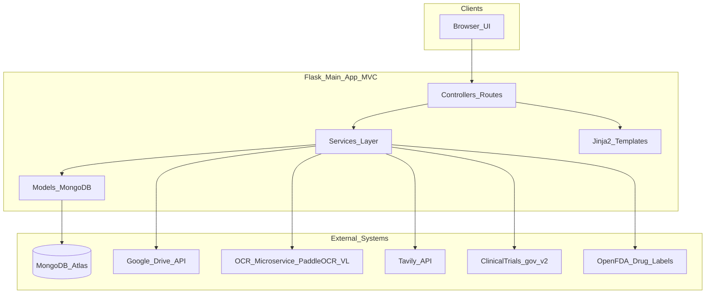
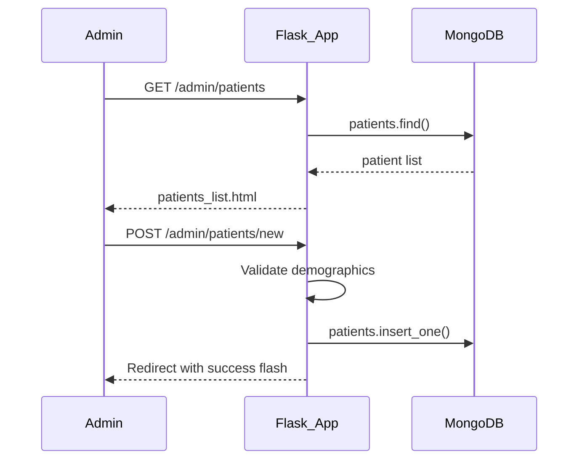
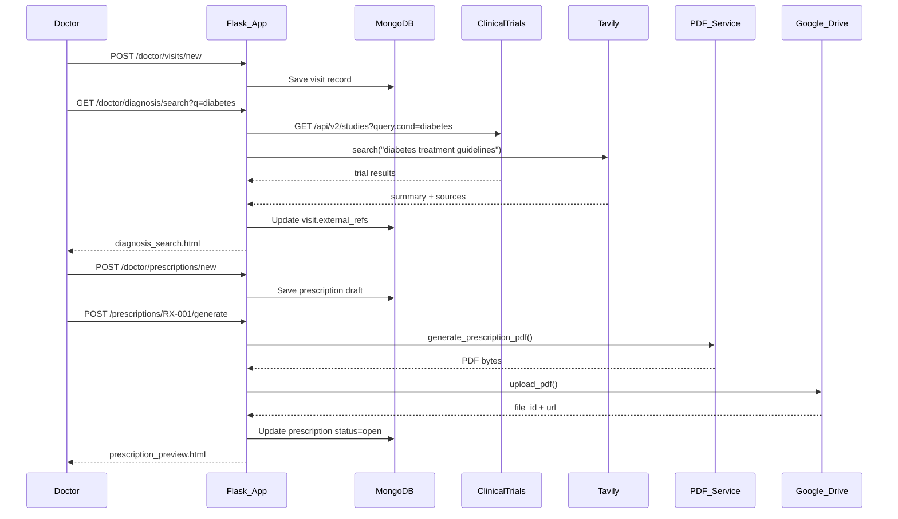
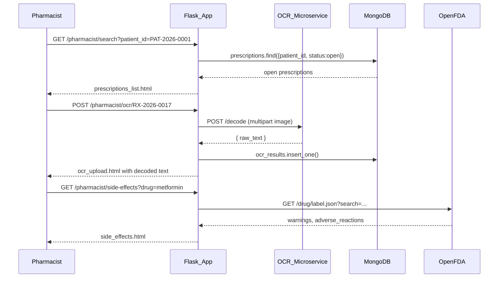

# Medical Information System ג€” Planning Document

> **Project:** Cloud-Based Medical Information System  
> **Stack:** Python 3.11+, Flask, MongoDB Atlas, Google Drive API  
> **Architecture:** Strict MVC (Model-View-Controller)  
> **Version:** 1.0 ג€” Initial Planning

---

## Table of Contents

1. [Executive Summary](#1-executive-summary)
2. [Architecture Overview](#2-architecture-overview)
3. [Folder Structure](#3-folder-structure)
4. [Core Files Reference](#4-core-files-reference)
5. [MongoDB Atlas Schema Design](#5-mongodb-atlas-schema-design)
6. [Roles and Feature Matrix](#6-roles-and-feature-matrix)
7. [Key Workflows](#7-key-workflows)
8. [External API Integrations](#8-external-api-integrations)
9. [OCR Microservice Design](#9-ocr-microservice-design)
10. [Security and Compliance](#10-security-and-compliance)
11. [Dependencies](#11-dependencies)
12. [Environment Variables](#12-environment-variables)
13. [Step-by-Step Development Plan](#13-step-by-step-development-plan)
14. [Testing Strategy](#14-testing-strategy)
15. [Local Development](#15-local-development)
16. [Deployment Notes](#16-deployment-notes)
17. [Future Enhancements](#17-future-enhancements)
18. [Appendix: Manual Test Checklist](#appendix-manual-test-checklist)

---

## 1. Executive Summary

### 1.1 Purpose

This system is a cloud-based medical information platform that supports three distinct user roles ג€” **Admin**, **Doctor**, and **Pharmacist** ג€” in managing patient records, clinical visits, prescription generation, and prescription verification through OCR.

The platform integrates with:

- **MongoDB Atlas** for persistent data storage
- **Google Drive API** for cloud storage of PDF prescriptions
- **Hugging Face PaddleOCR-VL** (via a local OCR microservice) for decoding prescription images
- **Tavily** and **ClinicalTrials.gov** for external diagnosis enrichment
- **OpenFDA** for structured drug side-effect lookup

### 1.2 Goals (v1)

| Goal | Description |
|------|-------------|
| Patient management | Admin can add and edit patient demographic records |
| Clinical workflow | Doctors record visits, enrich diagnoses, and generate PDF prescriptions |
| Cloud storage | Generated PDFs are uploaded to Google Drive and linked in the database |
| Pharmacist workflow | Pharmacists search patients, view open prescriptions, run OCR, and check side effects |
| Role isolation | Each role sees only the features and data permitted by RBAC |

### 1.3 Success Criteria

- [ ] Three roles authenticate and access role-specific dashboards
- [ ] Admin CRUD for patient demographics works end-to-end
- [ ] Doctor can create a visit, fetch external diagnosis info, and generate a PDF prescription saved to Google Drive
- [ ] Pharmacist can search by patient ID, view open prescriptions, upload an image for OCR decoding, and look up drug side effects
- [ ] All business logic lives in the Service layer; Controllers remain thin
- [ ] OCR runs as a separate microservice using PaddleOCR-VL via Hugging Face Transformers

### 1.4 Non-Goals (v1)

- HIPAA certification or production-grade PHI compliance
- EHR interoperability (HL7/FHIR)
- Real-time telemedicine or video visits
- Automated prescription field parsing from OCR output (raw text only in v1)
- Email or SMS notifications

---

## 2. Architecture Overview

### 2.1 High-Level System Diagram



### 2.2 Strict MVC Boundaries

| Layer | Responsibility | Location | Rules |
|-------|----------------|----------|-------|
| **Model** | MongoDB document schemas, validation, CRUD operations, index definitions | `app/models/` | No HTTP logic; no external API calls |
| **View** | Jinja2 HTML templates, CSS, client-side JavaScript | `app/templates/`, `app/static/` | No business logic; display data passed from controllers |
| **Controller** | HTTP routing, auth guards, request parsing, response selection | `app/controllers/` | Thin layer only ג€” validate input, call service, render template or return JSON |
| **Service** | Business rules, orchestration, external API clients | `app/services/` | All non-trivial logic lives here |

**Controller contract (every route handler):**

1. Apply authentication and role decorators
2. Parse and validate request data (form fields, query params, file uploads)
3. Call exactly one service method (or a small, explicit chain)
4. Return a rendered template, redirect, or JSON response
5. Never query MongoDB directly; never call external APIs directly

**Service contract:**

1. Accept typed/domain objects or plain dicts
2. Enforce business rules and raise domain exceptions
3. Call models for persistence and external clients for APIs
4. Return structured results to controllers

### 2.3 Request Flow Example

```
HTTP Request
    ג†’ Controller (auth + parse)
        ג†’ Service (business logic)
            ג†’ Model (MongoDB CRUD)
            ג†’ External API client (Tavily, Drive, etc.)
        ג† Service result
    ג† Template / JSON / Redirect
```

### 2.4 OCR Architecture Decision

**PaddleOCR-VL is not available on the Hugging Face hosted Inference API.** It must run locally or on a dedicated server/GPU VM.

**Chosen approach:** A separate **OCR microservice** (`ocr_service/`) runs on port `5001`. The main Flask app communicates with it over HTTP. This keeps the main app lightweight and allows the OCR model to run on a GPU machine independently.

---

## 3. Folder Structure

```
Cloud Computing Project/
ג”œג”€ג”€ PLANNING.md                     # This document
ג”œג”€ג”€ README.md                       # Setup and run instructions
ג”œג”€ג”€ .env.example                    # Environment variable template
ג”œג”€ג”€ .gitignore
ג”œג”€ג”€ requirements.txt                # Main app dependencies
ג”œג”€ג”€ run.py                          # Development entrypoint (port 5000)
ג”œג”€ג”€ wsgi.py                         # Production WSGI entrypoint
ג”‚
ג”œג”€ג”€ app/
ג”‚   ג”œג”€ג”€ __init__.py                 # Application factory: create_app()
ג”‚   ג”œג”€ג”€ config.py                   # Dev / Prod / Test config classes
ג”‚   ג”œג”€ג”€ extensions.py               # MongoDB client, Flask-Login manager
ג”‚   ג”‚
ג”‚   ג”œג”€ג”€ models/
ג”‚   ג”‚   ג”œג”€ג”€ __init__.py
ג”‚   ג”‚   ג”œג”€ג”€ user.py                 # Admin / Doctor / Pharmacist accounts
ג”‚   ג”‚   ג”œג”€ג”€ patient.py              # Patient demographics
ג”‚   ג”‚   ג”œג”€ג”€ visit.py                # Doctor visit records
ג”‚   ג”‚   ג”œג”€ג”€ prescription.py         # Prescription header, meds, Drive link
ג”‚   ג”‚   ג””ג”€ג”€ ocr_result.py           # OCR decode audit trail
ג”‚   ג”‚
ג”‚   ג”œג”€ג”€ controllers/
ג”‚   ג”‚   ג”œג”€ג”€ __init__.py             # Blueprint registration
ג”‚   ג”‚   ג”œג”€ג”€ auth_controller.py      # Login, logout
ג”‚   ג”‚   ג”œג”€ג”€ admin_controller.py     # Patient CRUD
ג”‚   ג”‚   ג”œג”€ג”€ doctor_controller.py    # Visits, diagnosis search, prescriptions
ג”‚   ג”‚   ג”œג”€ג”€ pharmacist_controller.py  # Search, OCR upload, side effects
ג”‚   ג”‚   ג””ג”€ג”€ api_controller.py       # JSON/AJAX endpoints
ג”‚   ג”‚
ג”‚   ג”œג”€ג”€ services/
ג”‚   ג”‚   ג”œג”€ג”€ __init__.py
ג”‚   ג”‚   ג”œג”€ג”€ auth_service.py
ג”‚   ג”‚   ג”œג”€ג”€ patient_service.py
ג”‚   ג”‚   ג”œג”€ג”€ visit_service.py
ג”‚   ג”‚   ג”œג”€ג”€ prescription_service.py
ג”‚   ג”‚   ג”œג”€ג”€ pdf_service.py          # ReportLab PDF generation
ג”‚   ג”‚   ג”œג”€ג”€ google_drive_service.py
ג”‚   ג”‚   ג”œג”€ג”€ ocr_client_service.py   # HTTP client to OCR microservice
ג”‚   ג”‚   ג”œג”€ג”€ tavily_service.py
ג”‚   ג”‚   ג”œג”€ג”€ clinicaltrials_service.py
ג”‚   ג”‚   ג””ג”€ג”€ drug_info_service.py    # OpenFDA side effects
ג”‚   ג”‚
ג”‚   ג”œג”€ג”€ middleware/
ג”‚   ג”‚   ג””ג”€ג”€ rbac.py                 # @role_required decorator
ג”‚   ג”‚
ג”‚   ג”œג”€ג”€ templates/
ג”‚   ג”‚   ג”œג”€ג”€ base.html
ג”‚   ג”‚   ג”œג”€ג”€ auth/
ג”‚   ג”‚   ג”‚   ג””ג”€ג”€ login.html
ג”‚   ג”‚   ג”œג”€ג”€ admin/
ג”‚   ג”‚   ג”‚   ג”œג”€ג”€ patients_list.html
ג”‚   ג”‚   ג”‚   ג””ג”€ג”€ patient_form.html
ג”‚   ג”‚   ג”œג”€ג”€ doctor/
ג”‚   ג”‚   ג”‚   ג”œג”€ג”€ visits_list.html
ג”‚   ג”‚   ג”‚   ג”œג”€ג”€ visit_form.html
ג”‚   ג”‚   ג”‚   ג”œג”€ג”€ diagnosis_search.html
ג”‚   ג”‚   ג”‚   ג””ג”€ג”€ prescription_preview.html
ג”‚   ג”‚   ג””ג”€ג”€ pharmacist/
ג”‚   ג”‚       ג”œג”€ג”€ patient_search.html
ג”‚   ג”‚       ג”œג”€ג”€ prescriptions_list.html
ג”‚   ג”‚       ג”œג”€ג”€ ocr_upload.html
ג”‚   ג”‚       ג””ג”€ג”€ side_effects.html
ג”‚   ג”‚
ג”‚   ג”œג”€ג”€ static/
ג”‚   ג”‚   ג”œג”€ג”€ css/
ג”‚   ג”‚   ג”‚   ג””ג”€ג”€ main.css
ג”‚   ג”‚   ג””ג”€ג”€ js/
ג”‚   ג”‚       ג””ג”€ג”€ app.js
ג”‚   ג”‚
ג”‚   ג””ג”€ג”€ utils/
ג”‚       ג”œג”€ג”€ validators.py           # Input validation helpers
ג”‚       ג””ג”€ג”€ helpers.py              # ID generation, date formatting
ג”‚
ג”œג”€ג”€ ocr_service/                    # Separate PaddleOCR-VL microservice
ג”‚   ג”œג”€ג”€ requirements.txt
ג”‚   ג”œג”€ג”€ run_ocr.py                  # Flask API server (port 5001)
ג”‚   ג”œג”€ג”€ ocr_engine.py               # Transformers model wrapper
ג”‚   ג””ג”€ג”€ schemas.py                  # Request/response schemas
ג”‚
ג”œג”€ג”€ scripts/
ג”‚   ג”œג”€ג”€ seed_users.py               # Seed admin, doctor, pharmacist accounts
ג”‚   ג””ג”€ג”€ setup_gdrive_oauth.py       # One-time Google OAuth token setup
ג”‚
ג”œג”€ג”€ credentials/                    # Git-ignored; service account JSON lives here
ג”‚   ג””ג”€ג”€ .gitkeep
ג”‚
ג””ג”€ג”€ tests/
    ג”œג”€ג”€ conftest.py
    ג”œג”€ג”€ test_patient_service.py
    ג”œג”€ג”€ test_prescription_service.py
    ג””ג”€ג”€ test_clinicaltrials_service.py
```

---

## 4. Core Files Reference

### 4.1 Application Bootstrap

#### `run.py`

Main development entrypoint. Loads environment variables and starts the Flask dev server on port 5000.

```python
from app import create_app

app = create_app()

if __name__ == "__main__":
    app.run(debug=True, port=5000)
```

#### `app/__init__.py`

Application factory pattern. Initializes extensions, registers blueprints, and configures the app.

```python
def create_app(config_name="development"):
    app = Flask(__name__)
    app.config.from_object(config[config_name])
    init_extensions(app)
    register_blueprints(app)
    return app
```

#### `app/config.py`

Configuration classes reading from environment variables:

| Variable | Purpose |
|----------|---------|
| `SECRET_KEY` | Flask session signing |
| `MONGODB_URI` | MongoDB Atlas connection string |
| `MONGODB_DB_NAME` | Database name (default: `medical_system`) |
| `GOOGLE_APPLICATION_CREDENTIALS` | Path to Google service account JSON |
| `GOOGLE_DRIVE_FOLDER_ID` | Target Drive folder for PDF uploads |
| `TAVILY_API_KEY` | Tavily search API key |
| `OCR_SERVICE_URL` | OCR microservice base URL (default: `http://localhost:5001`) |
| `MAX_UPLOAD_SIZE_MB` | Max OCR image upload size (default: 10) |

#### `app/extensions.py`

Shared singletons initialized once at startup:

- `mongo` ג€” PyMongo client bound to Flask app context
- `login_manager` ג€” Flask-Login session manager

---

### 4.2 Models

#### `app/models/user.py`

```python
# Collection: users
{
    "_id": ObjectId,
    "email": str,           # unique, indexed
    "password_hash": str,
    "role": str,            # "admin" | "doctor" | "pharmacist"
    "full_name": str,
    "created_at": datetime
}
```

**Public methods:** `find_by_email()`, `find_by_id()`, `create()`, `check_password()`

#### `app/models/patient.py`

```python
# Collection: patients
{
    "_id": ObjectId,
    "patient_id": str,      # human-readable ID, e.g. "PAT-2026-0001", unique indexed
    "first_name": str,
    "last_name": str,
    "date_of_birth": date,
    "gender": str,          # "male" | "female" | "other"
    "phone": str,
    "email": str,
    "address": {
        "street": str,
        "city": str,
        "state": str,
        "zip": str
    },
    "created_at": datetime,
    "updated_at": datetime
}
```

**Public methods:** `create()`, `find_by_patient_id()`, `find_all()`, `update()`, `search_by_name()`

#### `app/models/visit.py`

```python
# Collection: visits
{
    "_id": ObjectId,
    "visit_id": str,        # e.g. "VIS-2026-0001"
    "patient_id": str,      # references patients.patient_id
    "doctor_id": str,       # references users._id
    "visit_date": datetime,
    "chief_complaint": str,
    "diagnosis": str,
    "notes": str,
    "vitals": {
        "blood_pressure": str,
        "heart_rate": int,
        "temperature": float,
        "weight_kg": float
    },
    "external_refs": {
        "clinical_trials": [ { "nct_id": str, "title": str, "status": str } ],
        "tavily_summary": str
    },
    "created_at": datetime
}
```

**Public methods:** `create()`, `find_by_patient_id()`, `find_by_visit_id()`, `find_by_doctor_id()`

#### `app/models/prescription.py`

```python
# Collection: prescriptions
{
    "_id": ObjectId,
    "prescription_id": str,  # e.g. "RX-2026-0001"
    "patient_id": str,
    "doctor_id": str,
    "visit_id": str,
    "medications": [
        {
            "drug_name": str,
            "dosage": str,
            "frequency": str,
            "duration": str,
            "instructions": str
        }
    ],
    "general_instructions": str,
    "status": str,           # "open" | "filled" | "cancelled"
    "drive_file_id": str,    # Google Drive file ID
    "drive_file_url": str,   # Shareable/view link
    "created_at": datetime,
    "updated_at": datetime
}
```

**Public methods:** `create()`, `find_open_by_patient_id()`, `find_by_prescription_id()`, `update_status()`

#### `app/models/ocr_result.py`

```python
# Collection: ocr_results
{
    "_id": ObjectId,
    "prescription_id": str,
    "pharmacist_id": str,
    "image_filename": str,
    "raw_text": str,
    "decoded_at": datetime
}
```

**Public methods:** `create()`, `find_by_prescription_id()`

---

### 4.3 Controllers (Blueprints)

| Blueprint | Prefix | Key Routes |
|-----------|--------|------------|
| `auth_bp` | `/auth` | `GET/POST /login`, `GET /logout` |
| `admin_bp` | `/admin` | `GET /patients`, `GET/POST /patients/new`, `GET/POST /patients/<patient_id>/edit` |
| `doctor_bp` | `/doctor` | `GET /visits`, `GET/POST /visits/new`, `GET /diagnosis/search`, `GET/POST /prescriptions/new`, `POST /prescriptions/<id>/generate` |
| `pharmacist_bp` | `/pharmacist` | `GET /search`, `GET /prescriptions/<patient_id>`, `GET/POST /ocr/<prescription_id>`, `GET /side-effects` |
| `api_bp` | `/api` | `GET /health`, `GET /side-effects/<drug_name>`, `GET /diagnosis/trials`, `GET /diagnosis/tavily` |

All routes except `/auth/login` and `/api/health` require authentication and role checks.

---

### 4.4 Services

#### `app/services/auth_service.py`

- `authenticate(email, password) -> User | None`
- `logout_user()`

#### `app/services/patient_service.py`

- `create_patient(data) -> Patient`
- `update_patient(patient_id, data) -> Patient`
- `get_patient(patient_id) -> Patient`
- `list_patients(page, per_page) -> list[Patient]`

#### `app/services/visit_service.py`

- `create_visit(doctor_id, data) -> Visit`
- `get_visits_for_patient(patient_id) -> list[Visit]`
- `enrich_with_external_data(visit_id, diagnosis) -> Visit` ג€” calls Tavily + ClinicalTrials

#### `app/services/prescription_service.py`

- `create_prescription(doctor_id, data) -> Prescription`
- `generate_and_upload_pdf(prescription_id) -> Prescription` ג€” orchestrates PDF + Drive
- `get_open_prescriptions(patient_id) -> list[Prescription]`

#### `app/services/pdf_service.py`

- `generate_prescription_pdf(prescription, patient, doctor) -> bytes`

Uses ReportLab to render a formatted PDF with patient info, doctor info, medication table, and instructions.

#### `app/services/google_drive_service.py`

- `upload_pdf(file_bytes, filename) -> { file_id, file_url }`
- `delete_file(file_id) -> bool`

Uses Google Drive API v3 with a service account. Files are uploaded to the folder specified by `GOOGLE_DRIVE_FOLDER_ID`.

#### `app/services/ocr_client_service.py`

- `decode_prescription_image(image_bytes, filename) -> { raw_text, confidence }`

Sends a multipart POST to `{OCR_SERVICE_URL}/decode`. Stores result via `ocr_result` model.

#### `app/services/tavily_service.py`

- `search_diagnosis(query) -> { answer, results[] }`

Uses `TavilyClient.search()` with `include_answer=True` and `max_results=5`.

#### `app/services/clinicaltrials_service.py`

- `search_by_condition(condition, page_size=10) -> list[{ nct_id, title, status, phase }]`

Calls `GET https://clinicaltrials.gov/api/v2/studies?query.cond={condition}&pageSize={page_size}`.

#### `app/services/drug_info_service.py`

- `get_side_effects(drug_name) -> { drug, warnings[], adverse_reactions[] }`

Primary: OpenFDA Drug Label API.  
Fallback: Tavily search for `"<drug_name> side effects"`.

---

### 4.5 Middleware

#### `app/middleware/rbac.py`

```python
from functools import wraps
from flask_login import current_user

def role_required(*roles):
    def decorator(f):
        @wraps(f)
        def wrapped(*args, **kwargs):
            if not current_user.is_authenticated:
                return redirect(url_for("auth.login"))
            if current_user.role not in roles:
                abort(403)
            return f(*args, **kwargs)
        return wrapped
    return decorator
```

Usage: `@role_required("admin")`, `@role_required("doctor")`, `@role_required("pharmacist")`

---

## 5. MongoDB Atlas Schema Design

### 5.1 Collections Summary

| Collection | Purpose | Estimated Volume |
|------------|---------|-----------------|
| `users` | System accounts (3 roles) | Low (tens) |
| `patients` | Patient demographics | Medium (hundredsג€“thousands) |
| `visits` | Clinical visit records | Mediumג€“High |
| `prescriptions` | Prescription records + Drive links | Mediumג€“High |
| `ocr_results` | OCR decode audit trail | Medium |

### 5.2 Indexes

```javascript
// users
db.users.createIndex({ "email": 1 }, { unique: true })

// patients
db.patients.createIndex({ "patient_id": 1 }, { unique: true })
db.patients.createIndex({ "last_name": 1, "first_name": 1 })
db.patients.createIndex({ "first_name": "text", "last_name": "text" })

// visits
db.visits.createIndex({ "visit_id": 1 }, { unique: true })
db.visits.createIndex({ "patient_id": 1, "visit_date": -1 })
db.visits.createIndex({ "doctor_id": 1, "visit_date": -1 })

// prescriptions
db.prescriptions.createIndex({ "prescription_id": 1 }, { unique: true })
db.prescriptions.createIndex({ "patient_id": 1, "status": 1 })
db.prescriptions.createIndex({ "doctor_id": 1, "created_at": -1 })

// ocr_results
db.ocr_results.createIndex({ "prescription_id": 1 })
db.ocr_results.createIndex({ "decoded_at": -1 })
```

### 5.3 ID Generation Convention

Human-readable IDs are generated in `app/utils/helpers.py`:

| Entity | Format | Example |
|--------|--------|---------|
| Patient | `PAT-{YEAR}-{SEQ:04d}` | `PAT-2026-0001` |
| Visit | `VIS-{YEAR}-{SEQ:04d}` | `VIS-2026-0042` |
| Prescription | `RX-{YEAR}-{SEQ:04d}` | `RX-2026-0017` |

Sequence numbers are derived from a `counters` collection using atomic `$inc`.

### 5.4 Atlas Setup Steps

1. Create a free-tier or dedicated cluster at [cloud.mongodb.com](https://cloud.mongodb.com)
2. Create a database user with read/write permissions
3. Add your IP address (or `0.0.0.0/0` for development) to the Network Access allowlist
4. Copy the connection string: `mongodb+srv://<user>:<password>@<cluster>.mongodb.net/?retryWrites=true&w=majority`
5. Set `MONGODB_URI` and `MONGODB_DB_NAME=medical_system` in `.env`

---

## 6. Roles and Feature Matrix

### 6.1 Role Descriptions

| Role | Description |
|------|-------------|
| **Admin** | Manages patient demographic records. Cannot create visits or prescriptions. |
| **Doctor** | Records visit details, searches external diagnosis resources, generates PDF prescriptions uploaded to Google Drive. |
| **Pharmacist** | Searches patients by ID, views open prescriptions, uploads prescription images for OCR decoding, checks drug side effects. |

### 6.2 Feature Access Matrix

| Feature | Admin | Doctor | Pharmacist |
|---------|:-----:|:------:|:----------:|
| Login / Logout | Yes | Yes | Yes |
| Add patient demographics | Yes | ג€” | ג€” |
| Edit patient demographics | Yes | ג€” | ג€” |
| View patient list | Yes | Read-only | Search only |
| Create clinical visit | ג€” | Yes | ג€” |
| Enter diagnosis and notes | ג€” | Yes | ג€” |
| Fetch ClinicalTrials.gov data | ג€” | Yes | ג€” |
| Fetch Tavily diagnosis info | ג€” | Yes | ג€” |
| Build prescription (medications) | ג€” | Yes | ג€” |
| Generate PDF prescription | ג€” | Yes | ג€” |
| Upload PDF to Google Drive | ג€” | Yes | ג€” |
| Search patient by ID | Yes | Yes | Yes |
| View open prescriptions | ג€” | Own patients | Yes |
| Upload Rx image for OCR | ג€” | ג€” | Yes |
| View OCR decoded text | ג€” | ג€” | Yes |
| Check drug side effects | ג€” | ג€” | Yes |

### 6.3 Authentication Flow

- Session-based auth via **Flask-Login**
- Passwords hashed with `werkzeug.security.generate_password_hash()` (or `bcrypt`)
- On login, redirect to role-specific dashboard:
  - Admin ג†’ `/admin/patients`
  - Doctor ג†’ `/doctor/visits`
  - Pharmacist ג†’ `/pharmacist/search`
- Session cookie: `HttpOnly`, `SameSite=Lax`; set `Secure=True` in production

---

## 7. Key Workflows

### 7.1 Admin ג€” Patient Management



### 7.2 Doctor ג€” Visit, Diagnosis Enrichment, and Prescription



### 7.3 Pharmacist ג€” Search, OCR, Side Effects



---

## 8. External API Integrations

### 8.1 MongoDB Atlas

| Item | Detail |
|------|--------|
| Provider | MongoDB Atlas (cloud-hosted) |
| Driver | `pymongo[srv]` |
| Auth | Connection string with username/password |
| Setup | See [Section 5.4](#54-atlas-setup-steps) |

---

### 8.2 Google Drive API

**Purpose:** Store generated PDF prescriptions in the cloud.

**Setup steps:**

1. Go to [Google Cloud Console](https://console.cloud.google.com)
2. Create a project (or use existing)
3. Enable **Google Drive API**
4. Create a **Service Account** and download the JSON key file
5. Share the target Drive folder with the service account email (Editor permission)
6. Copy the folder ID from the Drive URL: `https://drive.google.com/drive/folders/{FOLDER_ID}`
7. Place the JSON key at `credentials/gdrive-service-account.json`
8. Set environment variables:
   - `GOOGLE_APPLICATION_CREDENTIALS=./credentials/gdrive-service-account.json`
   - `GOOGLE_DRIVE_FOLDER_ID=<folder_id>`

**Upload flow (`google_drive_service.py`):**

```python
from googleapiclient.discovery import build
from google.oauth2 import service_account

SCOPES = ["https://www.googleapis.com/auth/drive.file"]

def upload_pdf(file_bytes: bytes, filename: str) -> dict:
    creds = service_account.Credentials.from_service_account_file(
        os.environ["GOOGLE_APPLICATION_CREDENTIALS"], scopes=SCOPES
    )
    service = build("drive", "v3", credentials=creds)
    file_metadata = {
        "name": filename,
        "parents": [os.environ["GOOGLE_DRIVE_FOLDER_ID"]],
    }
    media = MediaIoBaseUpload(io.BytesIO(file_bytes), mimetype="application/pdf")
    file = service.files().create(body=file_metadata, media_body=media, fields="id,webViewLink").execute()
    return {"file_id": file["id"], "file_url": file["webViewLink"]}
```

---

### 8.3 Tavily API

**Purpose:** Doctor diagnosis enrichment ג€” web search with LLM-generated summary.

| Item | Detail |
|------|--------|
| SDK | `tavily-python` |
| Auth | `TAVILY_API_KEY` (sign up at [tavily.com](https://tavily.com)) |
| Endpoint | SDK `TavilyClient.search()` |

**Usage (`tavily_service.py`):**

```python
from tavily import TavilyClient

client = TavilyClient(api_key=os.environ["TAVILY_API_KEY"])

def search_diagnosis(query: str) -> dict:
    response = client.search(
        query=f"{query} medical diagnosis treatment",
        search_depth="advanced",
        max_results=5,
        include_answer=True,
    )
    return {
        "answer": response.get("answer", ""),
        "results": [
            {"title": r["title"], "url": r["url"], "content": r["content"]}
            for r in response.get("results", [])
        ],
    }
```

**Rate limits:** Free tier ג€” 1,000 searches/month. Use `search_depth="basic"` during development to conserve credits.

---

### 8.4 ClinicalTrials.gov API v2

**Purpose:** Doctor can fetch related clinical trials for a given diagnosis/condition.

| Item | Detail |
|------|--------|
| Base URL | `https://clinicaltrials.gov/api/v2` |
| Auth | None (public, unauthenticated) |
| Rate limit | ~50 requests/minute per IP |

**Key endpoint:**

```
GET /studies?query.cond={condition}&pageSize=10&format=json
```

**Usage (`clinicaltrials_service.py`):**

```python
import requests

BASE_URL = "https://clinicaltrials.gov/api/v2/studies"

def search_by_condition(condition: str, page_size: int = 10) -> list:
    params = {"query.cond": condition, "pageSize": page_size, "format": "json"}
    response = requests.get(BASE_URL, params=params, timeout=10)
    response.raise_for_status()
    studies = response.json().get("studies", [])
    results = []
    for study in studies:
        proto = study.get("protocolSection", {})
        ident = proto.get("identificationModule", {})
        status_mod = proto.get("statusModule", {})
        design = proto.get("designModule", {})
        results.append({
            "nct_id": ident.get("nctId", ""),
            "title": ident.get("briefTitle", ""),
            "status": status_mod.get("overallStatus", ""),
            "phase": ", ".join(design.get("phases", [])),
        })
    return results
```

**Pagination:** Use `nextPageToken` from the response as `pageToken` param for subsequent pages.

---

### 8.5 OpenFDA Drug Label API

**Purpose:** Pharmacist side-effect lookup with structured FDA data.

| Item | Detail |
|------|--------|
| Base URL | `https://api.fda.gov/drug/label.json` |
| Auth | None for basic use (API key optional for higher limits) |
| Rate limit | 240 requests/minute without key; 1,000/minute with key |

**Query example:**

```
GET /drug/label.json?search=openfda.generic_name:"metformin"&limit=1
```

**Relevant response fields:**

- `warnings` ג€” general warnings
- `adverse_reactions` ג€” reported adverse reactions
- `drug_interactions` ג€” known interactions
- `contraindications` ג€” when not to use

**Fallback:** If OpenFDA returns no results, `drug_info_service.py` calls Tavily with query `"{drug_name} drug side effects FDA"`.

---

## 9. OCR Microservice Design

### 9.1 Overview

The OCR microservice is a standalone Flask app in `ocr_service/` that loads **PaddleOCR-VL** via Hugging Face Transformers and exposes a single decode endpoint.

> **Note:** PaddleOCR-VL is **not** deployed on the Hugging Face hosted Inference API. It must run locally or on a GPU VM.

### 9.2 Architecture

```
Main Flask App (port 5000)
    ג”‚  HTTP POST /decode
    ג–¼
OCR Microservice (port 5001)
    ג”‚  PaddleOCR-VL via Transformers
    ג–¼
{ raw_text, confidence }
```

### 9.3 API Contract

#### `GET /health`

```json
{ "status": "ok", "model": "PaddlePaddle/PaddleOCR-VL-1.6" }
```

#### `POST /decode`

**Request:** `multipart/form-data` with field `image` (JPEG/PNG, max 10 MB)

**Response (200):**

```json
{
    "raw_text": "Metformin 500mg\nTake twice daily with meals\nDr. Smith",
    "confidence": null,
    "model": "PaddlePaddle/PaddleOCR-VL-1.6"
}
```

**Response (400):** `{ "error": "No image provided" }`  
**Response (500):** `{ "error": "OCR processing failed", "detail": "..." }`

### 9.4 OCR Engine (`ocr_service/ocr_engine.py`)

```python
from transformers import AutoModelForImageTextToText, AutoProcessor
from PIL import Image
import torch

MODEL_ID = "PaddlePaddle/PaddleOCR-VL-1.6"
DEVICE = "cuda" if torch.cuda.is_available() else "cpu"

class OCREngine:
    def __init__(self):
        self.model = AutoModelForImageTextToText.from_pretrained(
            MODEL_ID, torch_dtype=torch.bfloat16
        ).to(DEVICE).eval()
        self.processor = AutoProcessor.from_pretrained(MODEL_ID)

    def decode(self, image: Image.Image) -> str:
        messages = [{
            "role": "user",
            "content": [
                {"type": "image", "image": image},
                {"type": "text", "text": "OCR:"},
            ],
        }]
        inputs = self.processor.apply_chat_template(
            messages,
            add_generation_prompt=True,
            tokenize=True,
            return_dict=True,
            return_tensors="pt",
        ).to(self.model.device)
        outputs = self.model.generate(**inputs, max_new_tokens=512)
        return self.processor.decode(
            outputs[0][inputs["input_ids"].shape[-1]:], skip_special_tokens=True
        )
```

### 9.5 OCR Server (`ocr_service/run_ocr.py`)

```python
from flask import Flask, request, jsonify
from ocr_engine import OCREngine
from PIL import Image
import io

app = Flask(__name__)
engine = OCREngine()  # Loaded once at startup

@app.route("/health")
def health():
    return jsonify({"status": "ok", "model": "PaddlePaddle/PaddleOCR-VL-1.6"})

@app.route("/decode", methods=["POST"])
def decode():
    if "image" not in request.files:
        return jsonify({"error": "No image provided"}), 400
    file = request.files["image"]
    image = Image.open(io.BytesIO(file.read())).convert("RGB")
    raw_text = engine.decode(image)
    return jsonify({"raw_text": raw_text, "confidence": None})

if __name__ == "__main__":
    app.run(host="0.0.0.0", port=5001)
```

### 9.6 Hardware Requirements

| Environment | RAM | GPU | Expected Latency |
|-------------|-----|-----|-----------------|
| Development (CPU) | 8 GB+ | None | 30ג€“120 seconds/image |
| Development (GPU) | 8 GB+ | 4 GB VRAM+ | 2ג€“10 seconds/image |
| Production | 16 GB+ | 8 GB VRAM+ | 1ג€“5 seconds/image |

**First run:** Model weights (~1.8 GB) are downloaded from Hugging Face Hub automatically.

---

## 10. Security and Compliance

### 10.1 Authentication and Authorization

- Passwords stored as bcrypt/werkzeug hashes ג€” never plaintext
- Flask-Login session cookies with `HttpOnly` and `SameSite=Lax`
- `@role_required` decorator on every protected route
- Return HTTP 403 (not redirect) for authenticated users with wrong role on API routes

### 10.2 Secrets Management

- All secrets in `.env` (never committed)
- `credentials/` directory in `.gitignore`
- `.env.example` committed with placeholder values only

### 10.3 Input Validation

- Validate all form fields in controllers before passing to services
- Patient ID format: `PAT-\d{4}-\d{4}`
- OCR image uploads: allow only `image/jpeg`, `image/png`; max 10 MB
- Sanitize user input before rendering in templates (Jinja2 auto-escaping enabled)

### 10.4 Production Hardening

- Enable HTTPS (TLS termination at reverse proxy or cloud platform)
- Set `SESSION_COOKIE_SECURE=True` in production config
- Set `DEBUG=False`
- Use a strong random `SECRET_KEY` (32+ bytes)
- Restrict MongoDB Atlas IP allowlist to deployment server IPs

### 10.5 PHI Disclaimer

> **This is an academic/demonstration system.** It is **not** HIPAA-compliant and must not be used with real protected health information (PHI) in production. All sample data should be synthetic.

---

## 11. Dependencies

### 11.1 Main Application (`requirements.txt`)

```
Flask>=3.0
Flask-Login>=0.6
pymongo[srv]>=4.6
python-dotenv>=1.0
google-api-python-client>=2.100
google-auth-oauthlib>=1.2
google-auth-httplib2>=0.2
reportlab>=4.0
requests>=2.31
tavily-python>=0.5
Pillow>=10.0
bcrypt>=4.1
pytest>=8.0
pytest-mock>=3.12
```

### 11.2 OCR Microservice (`ocr_service/requirements.txt`)

```
flask>=3.0
transformers>=4.45
torch>=2.0
Pillow>=10.0
accelerate>=0.30
```

> Install OCR dependencies in a **separate virtual environment** to avoid torch/transformers conflicts with the main app.

---

## 12. Environment Variables

Create a `.env` file at the project root (copy from `.env.example`):

```env
# Flask
FLASK_ENV=development
FLASK_DEBUG=1
SECRET_KEY=change-me-to-a-random-32-byte-string

# MongoDB Atlas
MONGODB_URI=mongodb+srv://<user>:<password>@<cluster>.mongodb.net/?retryWrites=true&w=majority
MONGODB_DB_NAME=medical_system

# Google Drive
GOOGLE_APPLICATION_CREDENTIALS=./credentials/gdrive-service-account.json
GOOGLE_DRIVE_FOLDER_ID=your-drive-folder-id

# External APIs
TAVILY_API_KEY=tvly-your-api-key

# OCR Microservice
OCR_SERVICE_URL=http://localhost:5001

# Upload limits
MAX_UPLOAD_SIZE_MB=10
```

---

## 13. Step-by-Step Development Plan

### Phase 1 ג€” Project Scaffolding

**Goal:** Runnable Flask skeleton with config and health check.

| Task | Details |
|------|---------|
| Create folder structure | All directories from [Section 3](#3-folder-structure) |
| `requirements.txt` | Install main app dependencies |
| `app/__init__.py` | `create_app()` factory |
| `app/config.py` | Dev/Prod config classes |
| `app/extensions.py` | Mongo + LoginManager stubs |
| `run.py` | Dev server entrypoint |
| `.env.example` | All env vars documented |
| `.gitignore` | venv, .env, credentials/, __pycache__ |
| Health route | `GET /api/health` returns `{ "status": "ok" }` |

**Acceptance criteria:**
- [ ] `python run.py` starts without errors
- [ ] `GET http://localhost:5000/api/health` returns 200

---

### Phase 2 ג€” Database Layer

**Goal:** MongoDB Atlas connected; all models and indexes defined.

| Task | Details |
|------|---------|
| MongoDB Atlas setup | Cluster, user, IP allowlist, connection string |
| `app/extensions.py` | Initialize PyMongo with `MONGODB_URI` |
| All model files | user, patient, visit, prescription, ocr_result |
| Index creation | Run index script on first startup or via `scripts/init_db.py` |
| `app/utils/helpers.py` | ID generation with `counters` collection |
| `scripts/seed_users.py` | Create admin, doctor, pharmacist test accounts |

**Acceptance criteria:**
- [ ] App connects to MongoDB Atlas on startup
- [ ] All collections and indexes exist
- [ ] Seed script creates 3 users with known credentials

---

### Phase 3 ג€” Authentication and RBAC

**Goal:** Login/logout working; role-based route protection in place.

| Task | Details |
|------|---------|
| `app/models/user.py` | User model with Flask-Login `UserMixin` |
| `app/services/auth_service.py` | Authenticate, load user |
| `app/controllers/auth_controller.py` | Login form, logout route |
| `app/middleware/rbac.py` | `@role_required` decorator |
| `templates/base.html` | Layout with role-aware navigation |
| `templates/auth/login.html` | Login form |
| Role redirects | Admin/Doctor/Pharmacist dashboards after login |

**Acceptance criteria:**
- [ ] Each role can log in and is redirected to their dashboard
- [ ] Unauthorized roles receive 403 on protected routes
- [ ] Unauthenticated users are redirected to `/auth/login`

---

### Phase 4 ג€” Admin Module

**Goal:** Full patient CRUD for Admin role.

| Task | Details |
|------|---------|
| `app/services/patient_service.py` | create, update, get, list |
| `app/controllers/admin_controller.py` | CRUD routes with `@role_required("admin")` |
| `templates/admin/patients_list.html` | Paginated patient table |
| `templates/admin/patient_form.html` | Add/Edit form |
| `app/utils/validators.py` | Validate DOB, phone, required fields |
| Flash messages | Success/error feedback |

**Acceptance criteria:**
- [ ] Admin can list all patients
- [ ] Admin can add a new patient (auto-generates `patient_id`)
- [ ] Admin can edit existing patient demographics
- [ ] Validation errors are displayed inline

---

### Phase 5 ג€” Doctor Module

**Goal:** Visit recording, external diagnosis search, prescription builder, PDF generation.

| Task | Details |
|------|---------|
| `app/services/visit_service.py` | Create visit, enrich with external data |
| `app/services/clinicaltrials_service.py` | ClinicalTrials.gov v2 client |
| `app/services/tavily_service.py` | Tavily search client |
| `app/services/prescription_service.py` | Create prescription draft |
| `app/services/pdf_service.py` | ReportLab PDF generation |
| `app/controllers/doctor_controller.py` | All doctor routes |
| Doctor templates | visits_list, visit_form, diagnosis_search, prescription_preview |
| `app/controllers/api_controller.py` | AJAX endpoints for diagnosis search |

**Acceptance criteria:**
- [ ] Doctor can create a visit linked to a patient
- [ ] Diagnosis search returns ClinicalTrials + Tavily results
- [ ] Doctor can add medications and generate a PDF locally (before Drive upload)
- [ ] PDF contains patient name, doctor name, medications, and instructions

---

### Phase 6 ג€” Google Drive Integration

**Goal:** PDF prescriptions uploaded to Google Drive; link stored in MongoDB.

| Task | Details |
|------|---------|
| Google Cloud setup | Enable Drive API, create service account |
| `credentials/` | Place service account JSON (git-ignored) |
| Share Drive folder | With service account email |
| `app/services/google_drive_service.py` | upload_pdf, delete_file |
| Integrate into prescription flow | Call after PDF generation in `prescription_service` |
| Error handling | Graceful failure if Drive is unavailable |
| `scripts/setup_gdrive_oauth.py` | Optional OAuth setup helper |

**Acceptance criteria:**
- [ ] Generated PDF appears in the configured Google Drive folder
- [ ] Prescription record in MongoDB contains `drive_file_id` and `drive_file_url`
- [ ] Doctor sees a clickable Drive link on the prescription preview page

---

### Phase 7 ג€” OCR Microservice and Pharmacist Module

**Goal:** Pharmacist can search patients, view open Rx, run OCR, and check side effects.

| Task | Details |
|------|---------|
| `ocr_service/` | Full microservice with PaddleOCR-VL |
| `ocr_service/requirements.txt` | Separate venv for torch/transformers |
| `app/services/ocr_client_service.py` | HTTP client to OCR service |
| `app/services/drug_info_service.py` | OpenFDA + Tavily fallback |
| `app/controllers/pharmacist_controller.py` | All pharmacist routes |
| Pharmacist templates | patient_search, prescriptions_list, ocr_upload, side_effects |
| OCR error handling | Timeout, service unavailable messages |

**Acceptance criteria:**
- [ ] OCR microservice starts on port 5001 and responds to `/health`
- [ ] Pharmacist can search by `patient_id` and see open prescriptions
- [ ] Image upload triggers OCR decode; raw text displayed on page
- [ ] OCR result stored in `ocr_results` collection
- [ ] Side effects page shows OpenFDA data for a drug name

---

### Phase 8 ג€” Testing, Polish, and Deployment

**Goal:** Test coverage, README, and deployment-ready configuration.

| Task | Details |
|------|---------|
| `tests/conftest.py` | Flask test client, mocked MongoDB |
| Service unit tests | patient, prescription, clinicaltrials |
| Integration smoke test | Full role workflow |
| `README.md` | Setup, env vars, run commands |
| `wsgi.py` | Gunicorn-compatible entrypoint |
| CSS polish | Consistent styling in `main.css` |
| Deployment | Main app on Render/Railway/Cloud Run; OCR on GPU VM |

**Acceptance criteria:**
- [ ] `pytest` passes all tests
- [ ] README allows a new developer to run the system from scratch
- [ ] Manual test checklist (Appendix) passes for all three roles

---

## 14. Testing Strategy

### 14.1 Unit Tests (Service Layer)

Mock external HTTP calls. Test business logic in isolation.

| Test File | Covers |
|-----------|--------|
| `test_patient_service.py` | Create, update, validation, duplicate ID |
| `test_prescription_service.py` | Create, status transitions, PDF trigger |
| `test_clinicaltrials_service.py` | Response parsing, empty results, HTTP errors |

**Example pattern:**

```python
def test_search_by_condition_parses_response(mocker):
    mock_response = {"studies": [{"protocolSection": {"identificationModule": {"nctId": "NCT123", "briefTitle": "Test Trial"}}}]}
    mocker.patch("requests.get", return_value=Mock(json=lambda: mock_response, raise_for_status=lambda: None))
    results = search_by_condition("diabetes")
    assert results[0]["nct_id"] == "NCT123"
```

### 14.2 Integration Smoke Test

End-to-end workflow (manual or scripted):

1. Seed users and a test patient
2. Login as Doctor ג†’ create visit ג†’ search diagnosis ג†’ create prescription ג†’ generate PDF
3. Verify PDF in Google Drive and DB record
4. Login as Pharmacist ג†’ search patient ג†’ view open Rx ג†’ upload image ג†’ verify OCR text
5. Look up side effects for a medication

### 14.3 Test Commands

```bash
# Run all tests
pytest tests/ -v

# Run with coverage
pytest tests/ --cov=app/services --cov-report=term-missing
```

---

## 15. Local Development

### 15.1 Initial Setup

```bash
# Clone the project root
cd "Cloud Computing Project"

# Main app virtual environment
python -m venv venv
venv\Scripts\activate        # Windows
pip install -r requirements.txt

# OCR service virtual environment (separate)
cd ocr_service
python -m venv ocr_venv
ocr_venv\Scripts\activate    # Windows
pip install -r requirements.txt
cd ..

# Configure environment
copy .env.example .env
# Edit .env with your credentials

# Seed test users
python scripts/seed_users.py
```

### 15.2 Running the System

Open **two terminals**:

```bash
# Terminal 1 ג€” OCR microservice (port 5001)
cd ocr_service
ocr_venv\Scripts\activate
python run_ocr.py

# Terminal 2 ג€” Main Flask app (port 5000)
cd "Cloud Computing Project"
venv\Scripts\activate
python run.py
```

Access the app at: **http://localhost:5000**

### 15.3 Default Seed Credentials

| Role | Email | Password |
|------|-------|----------|
| Admin | admin@medical.local | admin123 |
| Doctor | doctor@medical.local | doctor123 |
| Pharmacist | pharmacist@medical.local | pharmacist123 |

> Change these in production. The seed script should read from env vars or prompt for passwords in non-dev environments.

---

## 16. Deployment Notes

### 16.1 Main Flask App

Deploy to any Python-compatible platform:

| Platform | Notes |
|----------|-------|
| Render | Free tier available; set env vars in dashboard |
| Railway | Simple Flask deploy; auto-detects `run.py` |
| GCP Cloud Run | Use `wsgi.py` with Gunicorn; containerize with Docker |

**Production checklist:**

- [ ] `FLASK_ENV=production`, `DEBUG=False`
- [ ] Strong `SECRET_KEY`
- [ ] MongoDB Atlas IP allowlist includes deployment server IP
- [ ] `SESSION_COOKIE_SECURE=True`
- [ ] Gunicorn or equivalent WSGI server configured via `wsgi.py`

### 16.2 OCR Microservice

Deploy separately on a machine with GPU access:

- Local dev machine (CPU acceptable for demos)
- GCP Compute Engine with GPU (T4 or better)
- Any cloud VM with CUDA support

Set `OCR_SERVICE_URL` in the main app to point to the OCR service URL (not `localhost` in production).

---

## 17. Future Enhancements

| Enhancement | Description |
|-------------|-------------|
| OCR field parsing | Extract drug name, dosage, frequency from raw OCR text using regex or NLP |
| Prescription status workflow | Pharmacist marks prescription as `filled` after dispensing |
| Audit log | Immutable log collection for all create/update/delete operations |
| Email notifications | Notify pharmacist when new prescription is created |
| Patient portal | Read-only patient access to own records |
| FHIR export | Export patient/visit data in HL7 FHIR format |
| OCR match warnings | Compare OCR decoded text against prescription record fields |
| Admin user management | Admin can create/edit doctor and pharmacist accounts |

---

## Appendix: Manual Test Checklist

### Admin

- [ ] Log in as admin -> redirected to `/admin/patients`
- [ ] Create new patient with all required fields -> success flash shown
- [ ] Edit patient demographics -> changes persisted in MongoDB
- [ ] Invalid data (missing name) -> validation error shown
- [ ] Logout -> session cleared, redirected to login

### Doctor

- [ ] Log in as doctor -> redirected to `/doctor/visits`
- [ ] Create visit for existing patient
- [ ] Search diagnosis -> ClinicalTrials results displayed
- [ ] Search diagnosis -> Tavily summary displayed
- [ ] Create prescription with medications
- [ ] Generate PDF -> file uploaded to Google Drive
- [ ] Prescription record has `drive_file_url` populated

### Pharmacist

- [ ] Log in as pharmacist -> redirected to `/pharmacist/search`
- [ ] Search by patient_id -> patient found
- [ ] View open prescriptions for patient
- [ ] Upload prescription image -> OCR text returned
- [ ] OCR result stored in `ocr_results` collection
- [ ] Search side effects for drug name -> OpenFDA data shown
- [ ] Unknown drug -> Tavily fallback or empty state shown

### Security

- [ ] Admin cannot access `/doctor/*` routes (403)
- [ ] Doctor cannot access `/admin/patients` (403)
- [ ] Pharmacist cannot access `/admin/patients` (403)
- [ ] Unauthenticated user redirected to login
- [ ] Invalid login credentials rejected with error message
